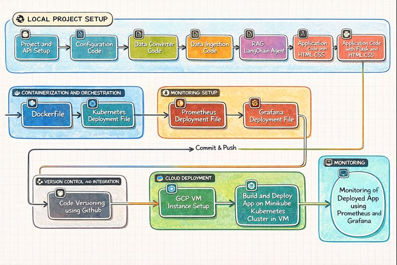
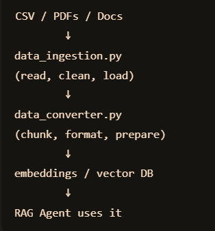
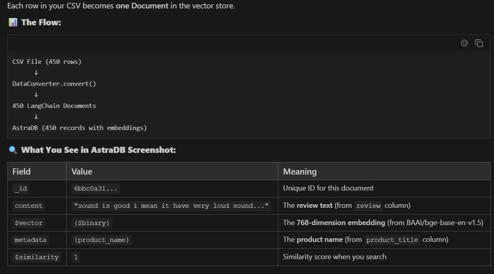
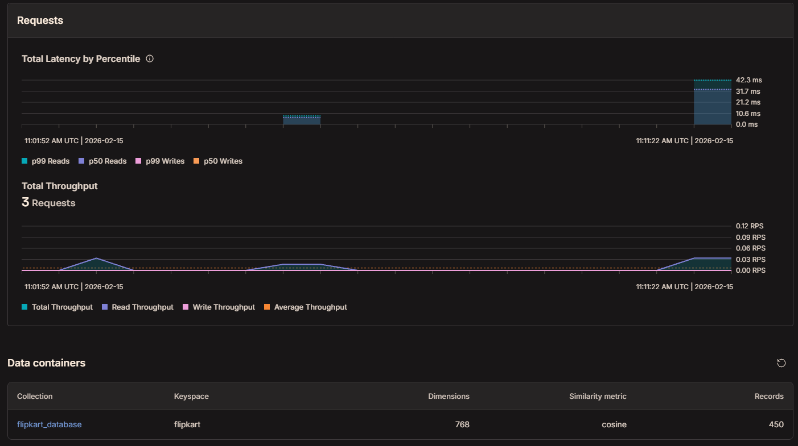

# 🛒 Flipkart Shopping Agent

A powerful **Retrieval-Augmented Generation (RAG)** AI agent designed to help users find products, analyze reviews, and get recommendations based on Flipkart product data. Built with **Flask**, **LangChain**, **Groq**, and **AstraDB**.

**What is this?**
This is an AI-powered shopping agent that helps users find products on Flipkart. It uses **RAG (Retrieval-Augmented Generation)** to look up real product reviews and specifications to give honest, data-backed recommendations.

---

## 🏗️ Architecture



This project follows a modern **LLMOps** workflow, integrating data ingestion, vector storage, and an autonomous agent to answer user queries effectively.

---

## 📂 Project Structure

```bash
flipkart-shopping-agent/
├── .github/                   # 🤖 GitHub Actions workflows
├── data/                      
│   └── flipkart_product_review.csv  # 💾 Raw dataset
├── grafana/
│   └── grafana-deployment.yaml      # 📈 Grafana K8s deployment
├── prometheus/
│   ├── prometheus-configmap.yaml    # ⚙️ Monitoring config
│   └── prometheus-deployment.yaml   # 🔍 Prometheus K8s deployment
├── src/
│   ├── agent/
│   │   └── rag_agent.py             # 🧠 Main RAG Logic (LangChain)
│   ├── config/
│   │   └── settings.py              # ⚙️ Environment settings
│   ├── pipeline/
│   │   ├── data_converter.py        # 🔄 CSV to Document converter
│   │   └── data_ingestion.py        # 💉 AstraDB Ingestion script
│   └── utils/
│       ├── custom_exception.py      # ⚠️ Error handling
│       └── logger.py                # 📝 System logging
├── static/
│   └── style.css                    # 🎨 Frontend styling
├── templates/
│   └── index.html                   # 🖥️ Frontend UI (Chat interface)
├── app.py                           # 🏁 Flask Application Entry Point
├── Dockerfile                       # 🐳 Docker build instructions
├── flask-deployment.yaml            # ☸️ Kubernetes Deployment
├── pyproject.toml                   # 🐍 Python dependencies
├── how-to-deploy.md                 # 📚 Deployment Guide
├── README.md                        # 📖 Project Overview
└── .gitignore                       # 🙈 Git ignore rules
```

---

## ⚡ How It Works (The Flow)

1. **User Asks a Question:** "What are the best headphones under 2000?"
2. **App Receives Request:** `app.py` gets the message at the `/chat` endpoint.
3. **Agent takes over:** The `RAGAgent` (in `src/agent/rag_agent.py`) wakes up.
4. **Information Retrieval:**
    - The agent uses a tool called `search_products`.
    - This tool searches **AstraDB** (a vector database) for products that match "best headphones" and "under 2000".
5. **AI Thinking:**
    - The retrieved product reviews are sent to **Groq** (a really fast AI model provider).
    - The AI reads the reviews and drafts a helpful response.
6. **Response:** The answer is sent back to `app.py` and displayed on your screen.

---

## 🧠 AI Agent Capabilities (The Heart of the Project)

The core logic resides in `src/agent/rag_agent.py`, built using the latest **LangChain** patterns:

- **Architecture**: Uses the modern `create_agent` API for robust tool-calling and reasoning.
- **Tools**: Equipped with a custom `search_products` tool that semantically searches AstraDB for relevant reviews.
- **Memory**: Maintains context-aware conversations using `ChatMessageHistory` and `BaseChatMessageHistory`, allowing for follow-up questions.
- **Persona**: Operates under a strict system prompt to ensure answers are:
  - Based **only** on retrieved reviews.
  - Honest about product pros and cons.
  - Helpful and concise.
- **Streaming**: Supports token-by-token streaming for a responsive UI experience.

---

## 🔄 RAG Pipeline & Data Flow

### 1. Data Ingestion Pipeline

The system ingests product reviews from CSV, converts them into vector embeddings, and stores them in AstraDB.



### 2. Vector Database Structure

We use **AstraDB (Cassandra)** as our vector store to enable semantic search capabilities.



---

## � AstraDB Database Metrics

Our AstraDB instance is optimized for high-performance vector search with the following characteristics:

- **Collection**: `flipkart_database`
- **Keyspace**: `flipkart`
- **Vector Dimensions**: 768
- **Similarity Metric**: Cosine
- **Total Records**: 450 product reviews

### Performance Monitoring



The database maintains consistent performance metrics:

- **Request Latency**: P99 reads at ~42.3ms, P50 reads at ~31.7ms
- **Throughput**: 3 total requests with balanced read/write operations
- **Real-time Monitoring**: Integrated with Prometheus and Grafana for continuous performance tracking

This ensures fast and reliable product recommendation retrieval for end-users.

---

## �🛠️ Tech Stack

- **LLM**: Groq (Llama3 / Mixtral)
- **Embeddings**: HuggingFace (`BAAI/bge-base-en-v1.5`)
- **Vector DB**: DataStax AstraDB (Cassandra)
- **Framework**: LangChain (Latest `create_agent` API, Tool Calling)
- **Backend**: Flask (Python)
- **Frontend**: HTML5, CSS3 (Flipkart Theme)
- **Containerization**: Docker
- **Orchestration**: Kubernetes (Minikube / GKE)

---

## 🚀 Quick Start (Local)

1. **Clone the repository**

   ```bash
   git clone https://github.com/your-username/flipkart-shopping-agent.git
   cd flipkart-shopping-agent
   ```

2. **Install Dependencies with `uv`**

   ```bash
   uv sync
   ```

3. **Set up Environment Variables**
   Create a `.env` file:

   ```env
   ASTRA_DB_API_ENDPOINT=...
   ASTRA_DB_APPLICATION_TOKEN=...
   GROQ_API_KEY=...
   HUGGINGFACEHUB_API_TOKEN=...
   ```

4. **Run Ingestion (First time only)**

   ```bash
   uv run python src/pipeline/data_ingestion.py
   ```

5. **Start Application**

   ```bash
   uv run python app.py
   ```

   Visit `http://localhost:5000` to chat!

---

## 🔍 Key Files Guide

If you want to understand or modify the code, here are the most important files:

- **`app.py`**: The main entry point. Runs the Flask server and handles the `/chat` API.
- **`src/agent/rag_agent.py`**: The AI logic. Where the LangChain agent lives, talks to Groq, and searches the database.
- **`src/pipeline/data_ingestion.py`**: Handles loading your CSV data into AstraDB so the AI can search it.
- **`templates/index.html`**: The frontend chat interface.
- **`src/config/settings.py`**: Where environment variables and configuration settings are loaded.

---

## 🚀 Deployment

To deploy to **Kubernetes**, use the provided deployment configuration:

```bash
kubectl apply -f flask-deployment.yaml
```

For complete cloud deployment instructions on **Google Cloud Platform (GCP)** using **Minikube**, refer to:

👉 [**how-to-deploy.md**](GCP-MINIKUBE-FLASK-DOCKER-PROMETHEUS-GARAFANA-DEPLOYMENT.md)

---

> [!NOTE]
> **This is a complete production-ready AI application** combining:
> - Modern LLM architectures (RAG with LangChain)
> - Cloud databases (AstraDB)
> - Web frameworks (Flask)
> - Container orchestration (Kubernetes on GCP/Minikube)

---

## 👤 Author

**Farhan**
